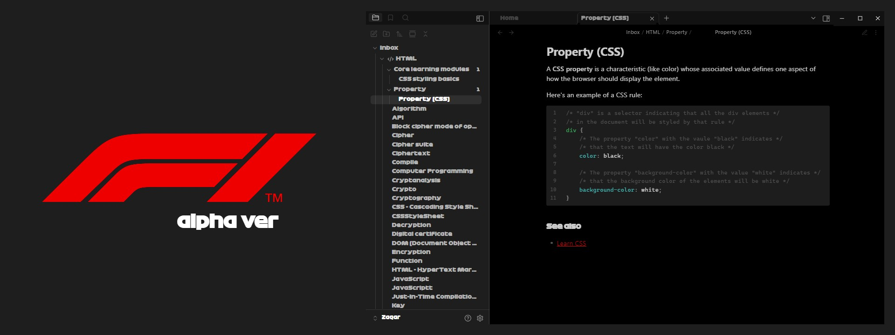
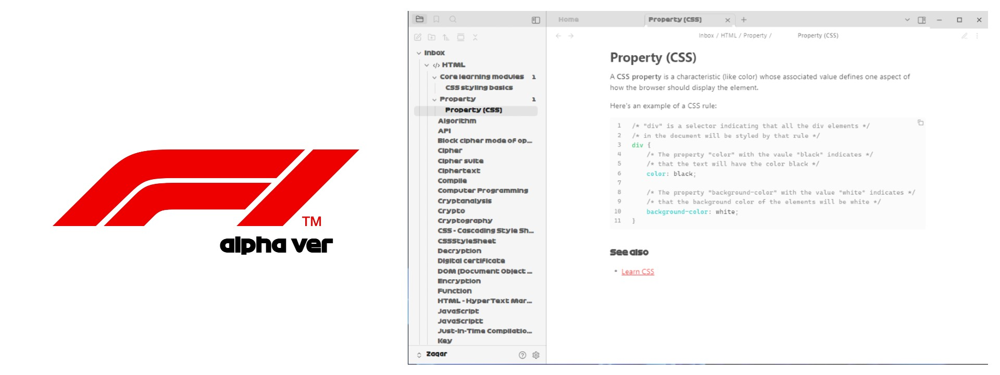

# 🏎 F1 Alpha - An Obsidian Theme Inspired by Formula 1

Welcome to **F1 Alpha**, a bold, high-contrast Obsidian theme inspired by the energy, precision, and style of modern Formula 1.

This theme is designed for those who want their workspace to feel fast, focused, and dramatic - like sitting in the cockpit of a high-tech racing machine.

  

---

## 🎨 What to Expect

- Dark mode, Light mode, sleek and intense  
- High contrast for visibility and focus  
- Red & black racing-inspired palette  
- Clean, grid-like spacing and telemetry-inspired UI cues  
- Designed to feel like a control center, not just a notepad

---

## 📥 Installation

> _Manual installation for now:_

1. Download the `f1-obsidian.css` file from this repo
2. Place it into your `.obsidian/themes/F1 Theme/` folder
3. Activate it in Obsidian’s **Settings → Appearance → Themes**

---

## ❤️ Thanks & Notes

This theme has been a passion project — built slowly, lap by lap, with a lot of late nights and CSS learning curves. If you’ve ever built a theme or even tinkered with one, you know the work behind the pixels.

Thanks to the Obsidian community for all the support, feedback, and inspiration.